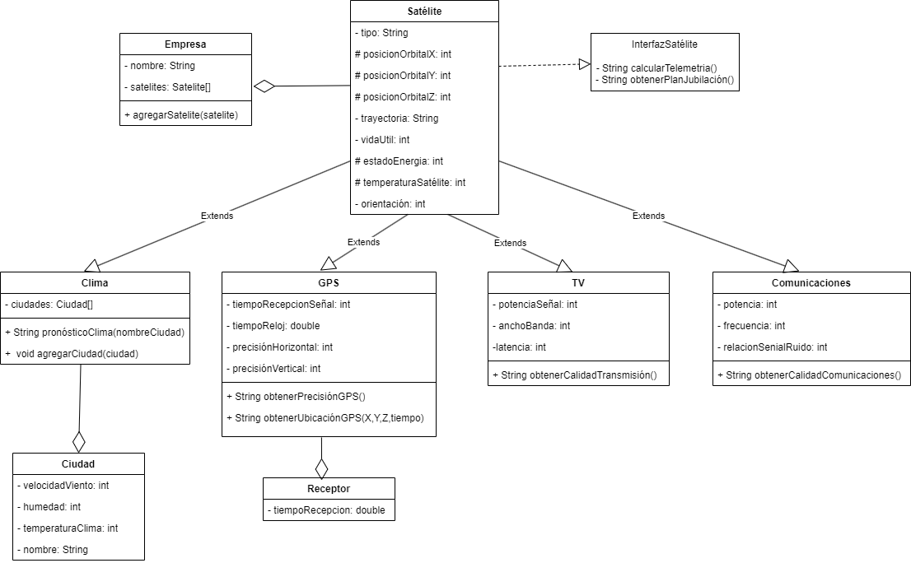

Participantes:
+ Luis Antonio Bautista C. bautistaluisantonio24@gmail.com
+ Mauricio Guerra maurogebe.96@gmail.com

Diagrama UML:

Durante el proceso de desarrollo, nos encontramos con diversos enfoques que requerían soluciones específicas y flexibles. Para abordar esta complejidad, optamos por trabajar con una interfaz. Esta elección se fundamentó en la diversidad de los métodos entre los distintos componentes del sistema. Utilizando una interfaz, pudimos definir métodos generales compartidos entre ellos, mientras que en cada implementación específica, se desarrollaron métodos particulares para abordar las necesidades concretas.

Además, para gestionar los atributos inherentes a cada enfoque, adoptamos una estructura jerárquica. Los atributos generales se centralizaron en la clase padre, 'Satélite', mientras que los atributos específicos de cada paradigma se integraron en las clases hijas correspondientes. Esta organización nos permitió mantener la coherencia en la representación de los diferentes modelos, al tiempo que facilitó la extensibilidad y la adaptación a nuevos requerimientos.

Cada desafío que enfrentamos fue abordado a través de una exhaustiva investigación. Por ejemplo, al enfrentarnos al problema de pronosticar el clima, nos sumergimos en el proceso de recopilación y análisis de datos específicos, seguido de un riguroso proceso de modelado para obtener predicciones precisas. Esta comprensión detallada del paradigma nos permitió diseñar soluciones efectivas y robustas que se alineaban con las necesidades del proyecto y los objetivos establecidos.

